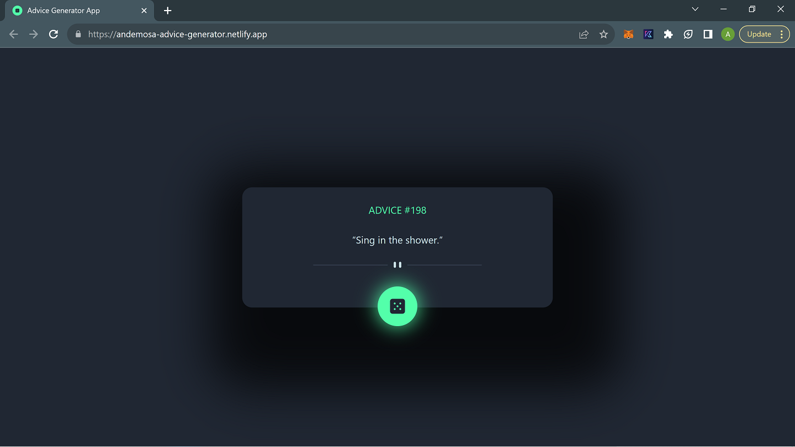
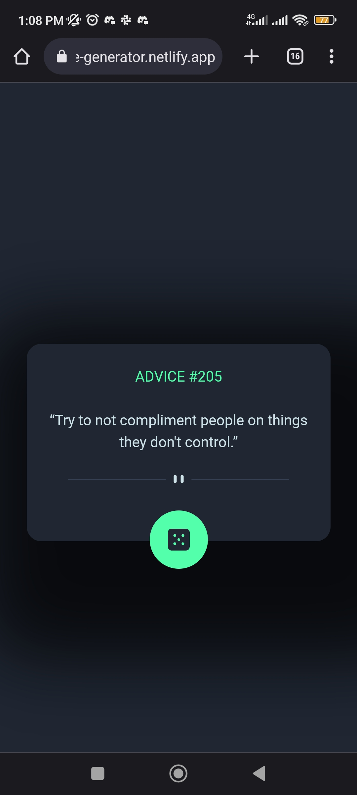

# Moviebox

This is an advice generator app. 

## Table of contents

- [Overview](#overview)
  - [The challenge](#the-challenge)
  - [Screenshot](#screenshot)
  - [Links](#links)
- [My process](#my-process)
  - [Built with](#built-with)
- [Author](#author)

## Overview

### The challenge

- Implement the [figma design](https://www.figma.com/file/5XLmnBEwWWGUtq1Ivnm7ei/advice-generator-app?type=design&node-id=0%3A48&mode=design&t=pmWRv6TxZiAL3eGi-1)
- Use data from [provided endpoint](https://api.adviceslip.com/)

### Screenshot


###



### Links

- Live Site URL: (https://andemosa-advice-generator.netlify.app/)

## My process

### Built with

- TypeScript
- [React](https://reactjs.org/)
- [Chakra UI](https://chakra-ui.com)
- [Vite](https://vitejs.dev/)
- [SWR](https://swr.vercel.app)


## Install

```
yarn install
```

## Getting Started

Then, run the development server:

```
yarn dev
```

Open [http://localhost:5173](http://localhost:5173) with your browser to see the result.

You can start editing the page by modifying `src/App.tsx`. The page auto-updates as you edit the file.

## Author

- Twitter - [@andemosa](https://www.twitter.com/andemosa)